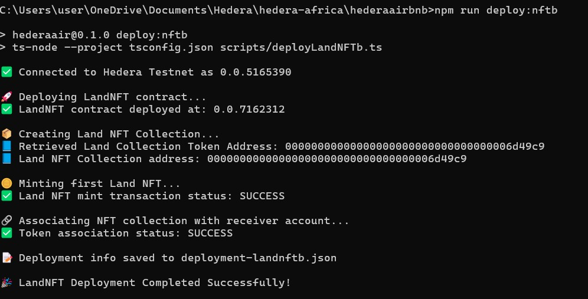
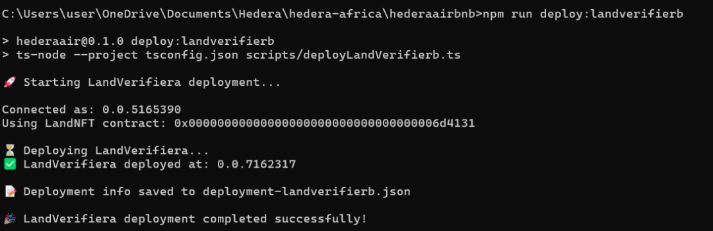
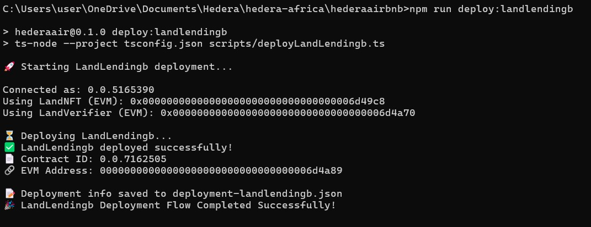

# 🏡 LandQ Smart Contracts Documentation

This repository contains the smart contracts for **LandQ**, a decentralized land ownership, verification, and lending platform built on the **Hedera** network.
LandQ transforms physical land parcels into NFTs, enables on-chain verification through trusted authorities, and supports land-backed DeFi lending.

---

## 📋 Table of Contents

* [Contract Overview](#contract-overview)
* [Core Contracts](#core-contracts)
* [Helper Contracts](#helper-contracts)
* [Contract Architecture](#contract-architecture)
* [Deployment](#deployment)
* [Usage Examples](#usage-examples)
* [Security Considerations](#security-considerations)

---

## 🏗️ Contract Overview

The **LandQ** platform is composed of **three primary smart contracts** and several **helper contracts** that interact with Hedera’s Token and Smart Contract Services.

### Core Contracts

1. **LandNFT** (`LandNFT.sol`) — Mints and manages land parcels as NFTs with geospatial metadata.
2. **LandVerifier** (`LandVerifier.sol`) — Handles on-chain verification requests and authority approvals.
3. **LandLending** (`LandLending.sol`) — Enables verified land NFTs to be used as collateral for loans.

### Helper Contracts

4. **HederaTokenService** — Interface for interacting with the Hedera Token Service.
5. **KeyHelper** — Manages administrative and verification-related keys.
6. **FeeHelper** — Handles transaction and service fees.
7. **ExpiryHelper** — Manages expiry settings for NFTs and verification records.
8. **HederaResponseCodes** — Standardized response code definitions.

---

## 🧱 Core Contracts

### 1. LandNFT Contract (`LandNFT.sol`)

**Purpose:**
Tokenizes physical land parcels as NFTs under Hedera’s Token Service (HTS). Each NFT holds verifiable geolocation, imagery, and ownership metadata stored on IPFS.

#### Key Features:

* **NFT Minting:** Mint land NFTs representing real parcels.
* **Metadata Integration:** Store land coordinates, region, image URLs, and price data on IPFS.
* **Ownership Management:** Ensure clear, immutable proof of land ownership.
* **Fractionalization:** Allows multiple fractional NFTs for shared ownership.

#### Example Functions:

```solidity
function mintLandNFT(string memory metadataURI) external returns (uint256);
function transferLand(address to, uint256 tokenId) external;
function getLandMetadata(uint256 tokenId) external view returns (string memory);
```

---

### 2. LandVerifier Contract (`LandVerifier.sol`)

**Purpose:**
Handles verification of land NFTs by registered authorities, storing the verification outcome immutably on-chain.

#### Key Features:

* **Request Verification:** NFT owners can submit a verification request.
* **Verifier Approval:** Only approved authorities can approve or reject.
* **Transparency:** Verification data is stored publicly and permanently.
* **Notes & Appraisal:** Includes optional verifier notes and appraised USD value.

#### Example Functions:

```solidity
function requestVerification(uint256 tokenId) external;
function approveVerification(uint256 tokenId, string memory notes, uint256 appraisedValue) external;
function rejectVerification(uint256 tokenId, string memory reason) external;
function getVerificationStatus(uint256 tokenId) external view returns (Verification memory);
```

---

### 3. LandLending Contract (`LandLending.sol`)

**Purpose:**
Enables verified land NFTs to be used as collateral for DeFi loans on Hedera using HTS tokens (e.g., USDT).

#### Key Features:

* **Collateralized Loans:** Borrow stablecoins against verified land.
* **Automated Liquidation:** Handle defaults and repayments programmatically.
* **Multi-Currency Support:** Supports USDT and HBAR.
* **On-Chain Transparency:** Loan and repayment history visible on Hedera Mirror Node.

#### Example Functions:

```solidity
function createLoan(uint256 tokenId, uint256 amount, uint256 duration) external;
function repayLoan(uint256 loanId, uint256 amount) external;
function liquidateLoan(uint256 loanId) external;
function getLoanDetails(uint256 loanId) external view returns (Loan memory);
```

---

## 🧩 Helper Contracts

### HederaTokenService

Provides a lightweight interface for Hedera’s native Token Service (HTS), handling NFT minting, transfers, and association logic.

### KeyHelper

Defines cryptographic key structures for admin, verifier, and lending roles.

### FeeHelper

Defines dynamic and flat fee structures for minting, verification, and loan services.

### ExpiryHelper

Sets token expiry configurations and auto-renew periods for persistent records.

### HederaResponseCodes

Standard Hedera response codes (e.g., `SUCCESS = 22`, `INVALID_TOKEN_ID`, etc.)

---

## 🏛️ Contract Architecture

```
┌─────────────────────────────────────────────────────────────┐
│                         LandQ Platform                      │
├─────────────────────────────────────────────────────────────┤
│                                                             │
│  ┌─────────────────────┐       ┌───────────────────────┐    │
│  │     LandNFT         │◄──────┤     LandVerifier      │    │
│  │ (Tokenization)      │       │ (Verification Logic)  │    │
│  └─────────────────────┘       └───────────────────────┘    │
│          │                           │                      │
│          ▼                           ▼                      │
│     ┌──────────────────────────────────────────────┐        │
│     │               LandLending                    │        │
│     │ (Collateralization & DeFi Loans)             │        │
│     └──────────────────────────────────────────────┘        │
│                 │                                            │
│                 ▼                                            │
│      ┌────────────────────────────────────────────┐          │
│      │             Helper Contracts               │          │
│      │ (HTS, Key, Fee, Expiry, Response Codes)    │          │
│      └────────────────────────────────────────────┘          │
└─────────────────────────────────────────────────────────────┘
```

---

## 🚀 Deployment

### Prerequisites

* Node.js, Hardhat
* Hedera Testnet Account
* HBAR balance for gas fees

### Compile & Deployment Commands

```bash
Perfect — here’s how you can present your **Basic Commands Reference** section neatly in your `README.md` so it looks professional and helps judges/developers navigate your repo easily 👇

---

## ⚙️ Basic Commands Reference

Below are the main scripts and commands used for compiling, deploying, linking, and testing the **LandQ smart contracts** on the Hedera Testnet.
Each command can be run using `npm run <command>` or `pnpm <command>`.

| **Command**             | **Description**                                                              |
| ----------------------- | ---------------------------------------------------------------------------- |                  
| `compile:landnftb`      | Compiles the `LandNFTb.sol` smart contract, generating ABI and binary files. |
| `compile:landverifierb` | Compiles the `LandVerifierb.sol` verification contract.                      |
| `compile:landLendingb`  | Compiles the `LandLendingb.sol` lending contract.                            |
| `deploy:nftb`           | Deploys the LandNFT contract to Hedera Testnet.                              |
| `deploy:landverifierb`  | Deploys the LandVerifier contract to Hedera Testnet.                         |
| `deploy:landlendingb`   | Deploys the LandLending contract to Hedera Testnet.                          |
| `link:LendingToNFT`     | Links the deployed LandLending contract to LandNFT for collateralization.    |
| `mint:landnftb`         | Mints a new Land NFT using IPFS metadata.                                    |
| `check:LandNFTOwner`    | Verifies ownership of a specific Land NFT on-chain.                          |
| `assign:Verifier`       | Assigns a new authorized verifier (e.g., government registry).               |
| `test:landnft`          | Runs an end-to-end test of the LandNFT minting and verification flow.        |

---

### 💻 Example Usage

```bash
# Compile all contracts

npm run compile:landnftb
npm run compile:landverifierb
npm run compile:landLendingb

# Deploy contracts on Hedera Testnet
npm run deploy:nftb
npm run deploy:landverifierb
npm run deploy:landlendingb

# Mint and verify a land NFT
npm run mint:landnftb
npm run assign:Verifier
npm run test:landnft
```
  

  



```

### Configuration Files

* `deployment-nft.json` — LandNFT deployment details
* `deployment-verifiera.json` — LandVerifier deployment info
* `deployment-lendingb.json` — LandLending deployment info

---

## 💡 Usage Examples

### Mint a Land NFT

```javascript
await landNFT.mintLandNFT("ipfs://QmXYZ12345"); // IPFS metadata
```

### Request Verification

```javascript
await landVerifier.requestVerification(1); // NFT #1
```

### Approve Verification

```javascript
await landVerifier.approveVerification(1, "Verified by Lagos Registry", 150000);
```

### Create a Loan

```javascript
await landLending.createLoan(1, 50000, 90); // 50k USDT for 90 days
```

---

## 🔒 Security Considerations

* **Access Control:** Only NFT owners can initiate verification or loans.
* **Role-Based Verification:** Only trusted verifiers can approve land NFTs.
* **Escrow Safety:** Loan funds are locked until repayment or liquidation.
* **Immutability:** All verification results are permanent on Hedera.
* **Gas Optimization:** Designed with lightweight HTS operations for cost efficiency.

---

## 📈 Hedera Advantage

* **Low, predictable fees** for on-chain land transactions
* **Government-friendly governance model** — enabling verified land authorities to act as trusted nodes
* **Fast finality** ensures instant ownership and lending updates
* **ABFT consensus** provides high integrity for land and loan records
* **Native EVM compatibility** makes integration seamless with MetaMask

---

## 📝 License

MIT License — Open for academic, hackathon, and pilot use.

---

## 📞 Contact

**Contact:** [[0xlandq@gmail.com](mailto:0xlandq@gmail.com)]  
**Team:** LandQ Builders  
**Track:** Onchain Finance & Real-World Assets (RWA)

